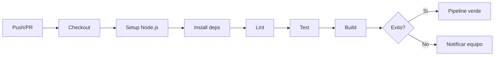

# Taller Practico: Prompts para Pruebas Automatizadas y Documentacion de Pipeline

## Duracion: 30 minutos (10:45 - 11:15)

---

## Objetivo

Usar Kiro para generar pruebas automatizadas que validen la logica de tu aplicacion y documentar los pipelines creados en el Lab 2, todo asistido por prompts inteligentes.

---

## Lo que vas a lograr

- [ ] Crear codigo fuente de ejemplo para testear
- [ ] Generar tests unitarios con Kiro
- [ ] Generar tests de integracion para el pipeline
- [ ] Documentar el pipeline CI con explicaciones claras
- [ ] Crear un runbook operativo basico

---

## Parte 1: Crear codigo fuente base (5 min)

Primero necesitamos codigo que testear. Pide a Kiro:

> **Prompt:**
> "Crea un modulo en `src/utils.js` con las siguientes funciones:
> - `validateEmail(email)`: valida formato de email
> - `slugify(text)`: convierte texto a slug URL-friendly
> - `calculateDiscount(price, percentage)`: calcula precio con descuento
> - `formatCurrency(amount, currency)`: formatea un monto como moneda
>
> Exporta todas las funciones. Agrega JSDoc a cada una."

### Resultado esperado:

```javascript
// src/utils.js

/**
 * Valida si un string tiene formato de email valido
 * @param {string} email - El email a validar
 * @returns {boolean} true si el email es valido
 */
function validateEmail(email) {
  const regex = /^[^\s@]+@[^\s@]+\.[^\s@]+$/;
  return regex.test(email);
}

/**
 * Convierte un texto a formato slug URL-friendly
 * @param {string} text - Texto a convertir
 * @returns {string} Texto en formato slug
 */
function slugify(text) {
  return text
    .toLowerCase()
    .trim()
    .replace(/[^\w\s-]/g, '')
    .replace(/[\s_-]+/g, '-')
    .replace(/^-+|-+$/g, '');
}

/**
 * Calcula el precio con descuento aplicado
 * @param {number} price - Precio original
 * @param {number} percentage - Porcentaje de descuento (0-100)
 * @returns {number} Precio con descuento
 */
function calculateDiscount(price, percentage) {
  if (percentage < 0 || percentage > 100) {
    throw new Error('El porcentaje debe estar entre 0 y 100');
  }
  return price - (price * percentage / 100);
}

/**
 * Formatea un monto numerico como moneda
 * @param {number} amount - Monto a formatear
 * @param {string} currency - Codigo de moneda (USD, COP, EUR)
 * @returns {string} Monto formateado
 */
function formatCurrency(amount, currency = 'COP') {
  return new Intl.NumberFormat('es-CO', {
    style: 'currency',
    currency: currency
  }).format(amount);
}

module.exports = { validateEmail, slugify, calculateDiscount, formatCurrency };
```

---

## Parte 2: Generar tests unitarios (10 min)

### 2.1 Configurar Jest

> **Prompt:**
> "Configura Jest en mi proyecto: agrega la dependencia de desarrollo,
> el script de test en package.json, y crea un archivo jest.config.js
> basico con cobertura habilitada."

### 2.2 Generar tests completos

> **Prompt:**
> "Genera tests unitarios completos en `tests/utils.test.js` para todas
> las funciones de `src/utils.js`. Incluye:
> - Casos positivos (happy path)
> - Casos de borde (edge cases)
> - Casos de error (inputs invalidos)
> - Al menos 3 tests por funcion
> - Describe blocks organizados por funcion
> - Comentarios en espanol explicando que valida cada test"

### Resultado esperado (fragmento):

```javascript
// tests/utils.test.js
const { validateEmail, slugify, calculateDiscount, formatCurrency } = require('../src/utils');

describe('validateEmail', () => {
  // Casos validos
  test('acepta un email con formato correcto', () => {
    expect(validateEmail('usuario@carvajal.com')).toBe(true);
  });

  test('acepta email con subdominios', () => {
    expect(validateEmail('dev@mail.carvajal.com.co')).toBe(true);
  });

  // Casos invalidos
  test('rechaza email sin @', () => {
    expect(validateEmail('usuario.carvajal.com')).toBe(false);
  });

  test('rechaza email sin dominio', () => {
    expect(validateEmail('usuario@')).toBe(false);
  });

  test('rechaza string vacio', () => {
    expect(validateEmail('')).toBe(false);
  });
});

describe('slugify', () => {
  test('convierte texto simple a slug', () => {
    expect(slugify('Hola Mundo')).toBe('hola-mundo');
  });

  test('elimina caracteres especiales', () => {
    expect(slugify('Producto #1: Oferta!')).toBe('producto-1-oferta');
  });

  test('maneja multiples espacios', () => {
    expect(slugify('  muchos   espacios  ')).toBe('muchos-espacios');
  });
});

describe('calculateDiscount', () => {
  test('calcula descuento del 10% correctamente', () => {
    expect(calculateDiscount(100, 10)).toBe(90);
  });

  test('descuento de 0% devuelve precio original', () => {
    expect(calculateDiscount(50, 0)).toBe(50);
  });

  test('descuento de 100% devuelve 0', () => {
    expect(calculateDiscount(200, 100)).toBe(0);
  });

  // Casos de error
  test('lanza error con porcentaje negativo', () => {
    expect(() => calculateDiscount(100, -5)).toThrow();
  });

  test('lanza error con porcentaje mayor a 100', () => {
    expect(() => calculateDiscount(100, 150)).toThrow();
  });
});

describe('formatCurrency', () => {
  test('formatea en COP por defecto', () => {
    const result = formatCurrency(50000);
    expect(result).toContain('50.000');
  });

  test('formatea en USD cuando se especifica', () => {
    const result = formatCurrency(100, 'USD');
    expect(result).toContain('100');
    expect(result).toContain('US');
  });
});
```

### 2.3 Ejecutar los tests

```bash
# Instalar Jest
npm install --save-dev jest

# Ejecutar tests
npm test

# Ejecutar con cobertura
npx jest --coverage
```

> **Nota**: Estos comandos (`npm`, `npx`) funcionan igual en macOS, Linux y Windows. Si ves un error de "execution policy" en PowerShell, ejecuta: `Set-ExecutionPolicy -Scope CurrentUser -ExecutionPolicy RemoteSigned`

### 2.4 Iterar si hay fallos

Si algun test falla, usa Kiro:

> "El test [nombre] falla con este error: [error]. Ajusta el test o la
> funcion para que pase correctamente."

---

## Parte 3: Documentar el pipeline (10 min)

### 3.1 Generar documentacion del pipeline CI

> **Prompt:**
> "Genera un archivo `docs/PIPELINE.md` que documente el pipeline CI
> que creamos en `.github/workflows/ci.yml`. Incluye:
> - Diagrama del flujo (usando ASCII o mermaid)
> - Descripcion de cada step y por que existe
> - Variables de entorno y secrets necesarios
> - Como agregar nuevos steps
> - Troubleshooting de errores comunes
> - Contacto del equipo responsable"

### Resultado esperado (estructura):

```markdown
# Documentacion del Pipeline CI

## Diagrama de flujo



## Steps del pipeline

| Step | Proposito | Tiempo estimado |
|------|-----------|-----------------|
| Checkout | Descarga el codigo | ~5s |
| Setup Node.js | Configura runtime | ~10s |
| Install deps | Instala paquetes | ~30s (con cache) |
| Lint | Verifica estilo | ~15s |
| Test | Ejecuta pruebas | ~45s |
| Build | Compila proyecto | ~30s |

## Secrets requeridos

| Secret | Descripcion | Donde obtenerlo |
|--------|-------------|-----------------|
| GITHUB_TOKEN | Token automatico | Provisto por GitHub |
| CARVAJAL_SLACK_WEBHOOK | URL del webhook | Admin de Slack |

## Troubleshooting

| Error | Causa probable | Solucion |
|-------|---------------|----------|
| npm ci fails | Lock file desactualizado | Ejecutar npm install local |
| Lint errors | Codigo no formateado | Ejecutar npm run lint:fix |
| Test timeout | Test asincrono sin await | Revisar async/await |
```

### 3.2 Generar runbook operativo

> **Prompt:**
> "Genera un archivo `docs/RUNBOOK.md` con un runbook operativo que incluya:
> - Como hacer rollback de un deploy
> - Como re-ejecutar un pipeline fallido
> - Como agregar un nuevo secret al repositorio
> - Como habilitar/deshabilitar un workflow
> - Escalamiento: a quien contactar en cada escenario
> Formato: pasos numerados, concisos, con comandos copy-paste"

---

## Parte 4: Hook de documentacion automatica (5 min)

### 4.1 Crear hook que recuerde documentar

> **Prompt:**
> "Crea un hook de Kiro que cuando se modifique un archivo en
> .github/workflows/, me recuerde actualizar la documentacion
> en docs/PIPELINE.md"

### Resultado:

```json
{
  "version": "v1",
  "hooks": [{
    "name": "Recordar actualizar docs de pipeline",
    "trigger": "PostFileSave",
    "matcher": "\\.github/workflows/.*\\.yml$",
    "action": {
      "type": "agent",
      "prompt": "Se ha modificado un workflow de CI/CD. Recuerda al usuario que debe actualizar la documentacion en docs/PIPELINE.md para reflejar los cambios realizados."
    }
  }]
}
```

---

## Resumen de prompts clave aprendidos

| Categoria | Prompt pattern |
|-----------|---------------|
| Tests unitarios | "Genera tests para [archivo] cubriendo happy path, edge cases y errores" |
| Tests integracion | "Genera tests que validen el flujo completo de [feature]" |
| Documentacion pipeline | "Documenta el pipeline en [path] incluyendo diagrama, steps y troubleshooting" |
| Runbook | "Genera un runbook con pasos para [operacion] incluyendo comandos y escalamiento" |
| Coverage | "Identifica funciones sin cobertura de tests y genera los tests faltantes" |

---

## Verificacion final

```
proyecto/
├── src/
│   └── utils.js              ✓ Codigo con JSDoc
├── tests/
│   └── utils.test.js         ✓ Tests completos
├── docs/
│   ├── PIPELINE.md           ✓ Documentacion del CI
│   └── RUNBOOK.md            ✓ Runbook operativo
├── jest.config.js            ✓ Configuracion de Jest
└── .kiro/hooks/
    └── docs-reminder.json    ✓ Hook de recordatorio
```

### Commit

```bash
git add src/ tests/ docs/ jest.config.js .kiro/
git commit -m "feat: agregar tests, documentacion de pipeline y hook de docs"
git push origin main
```

> **Nota Windows**: Si usas CMD y falla con las rutas, usa `git add -A` como alternativa para agregar todos los archivos modificados.

---

## Siguiente: [Revision de resultados y buenas practicas →](../02-revision-resultados.md)
